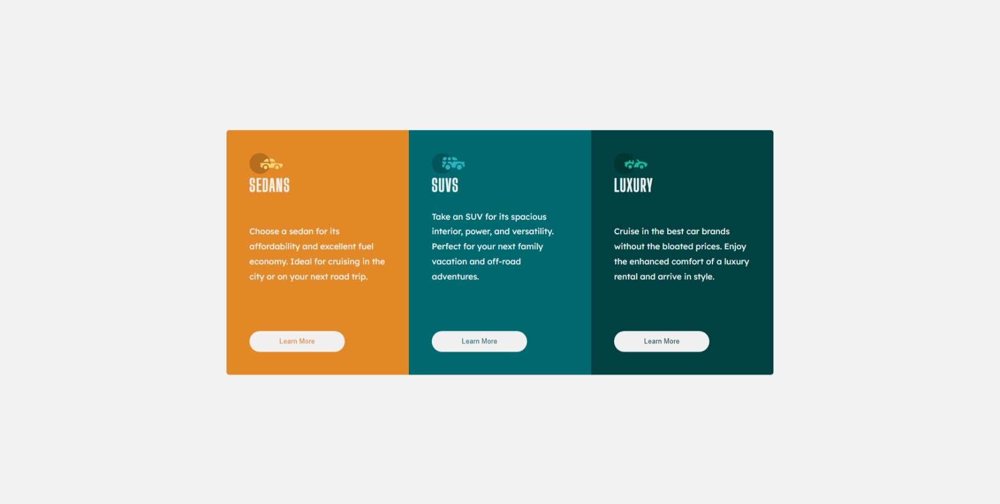

# 3-column
Esta é minha solução para o [Order summary card challenge on Frontend Mentor](https://www.frontendmentor.io/challenges/order-summary-component-QlPmajDUj).

## Índice

- [Visão geral](#visão-geral)
   - [Captura de tela](#captura-de-tela)
   * [Tecnologias](#tecnologias)
   - [Links](#links)
    
 
## Visão Geral
Projeto executado para estudo e pratica de HTML e CSS

## Captura de Tela
✔Desktop

 

 ✔Mobile
 

 

## Tecnologias
Este projeto foi desenvolvido utilizando as tecnologias referenciadas a baixo:
- ``HTML`` 
- ``CSS ``
- ``VARIÁVEIS``
- ``FLEXBOX``
- ``CSS GRID``

## Links
[Link para página do projeto](https://renannevesc94.github.io/3-column/)
