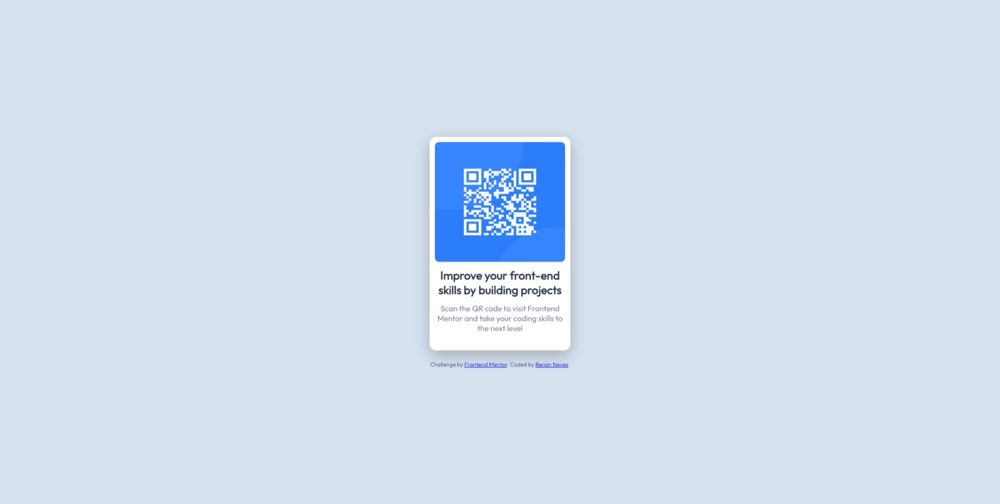

# QRCode-Component

Esta é minha solução para o [desafio do componente de código QR no Frontend Mentor](https://www.frontendmentor.io/challenges/qr-code-component-iux_sIO_H).

## Índice

- [QRCode-Component](#qrcode-component)
  - [Índice](#índice)
  - [Visão Geral](#visão-geral)
  - [Captura de Tela](#captura-de-tela)
  - [Tecnologias](#tecnologias)
  - [Links](#links)
    
 
## Visão Geral
Projeto executado para estudo e pratica da minipulação de documentos HTML e CSS

## Captura de Tela
✔Desktop

 

 ✔Mobile
 

 

## Tecnologias
Este projeto foi desenvolvido utilizando as tecnologias referenciadas a baixo:
- ``HTML`` 
- ``CSS ``
- ``FLEXBOX``

## Links
[Link do projeto](https://renannevesc94.github.io/frontend-mentor/QRCode-Component-main/)